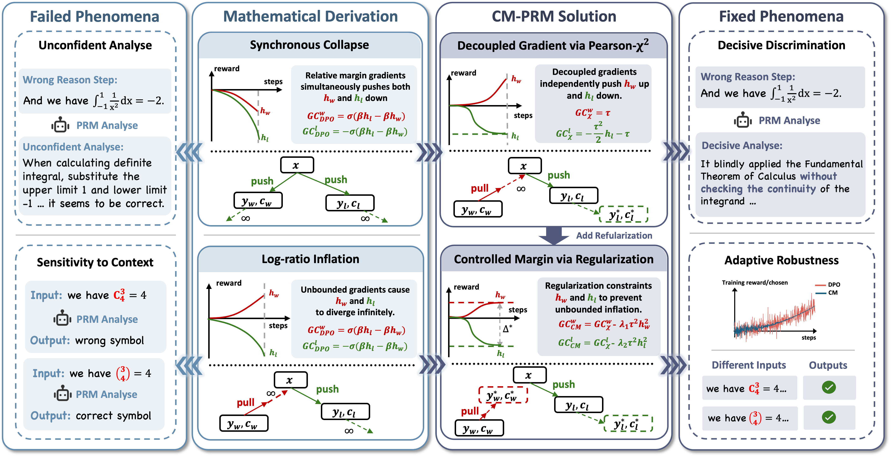

<h1 align="center">CM-PRM: Controlled-Margin Contrastive Learning for Process Reward Models</h1>

<figure align="center">
    
</figure>


# Overview

CM-PRM is a process reward modeling framework designed to improve step-level reasoning assessment under preference-based supervision. 

This repository is intended to provide code for model training, evaluation, and downstream usage in guided reasoning or search settings.

# Environment Setup

Create the environment from `environment.yml`:

```bash
conda env create -f environment.yml
conda activate cmprm
```

If your project uses CUDA / distributed training, please also make sure that the correct PyTorch and accelerator versions are installed.

# Dataset Preparation
You can download the datasets for different tasks from the following links:


- **Training Set**
    - SFT & CL Dataset: [https://huggingface.co/datasets/kevinpro/R-PRM/tree/main](https://huggingface.co/datasets/kevinpro/R-PRM/tree/main)
- **Evaluation Set**
    - ProcessBench: [https://huggingface.co/datasets/Qwen/ProcessBench](https://huggingface.co/datasets/Qwen/ProcessBench)
    - PRMBench: [https://huggingface.co/datasets/hitsmy/PRMBench_Preview/tree/main](https://huggingface.co/datasets/hitsmy/PRMBench_Preview/tree/main)
    - BoN: [https://github.com/NJUNLP/R-PRM/tree/main/src/datasets](https://github.com/NJUNLP/R-PRM/tree/main/src/datasets)

# Training
Create the required directories:

```bash
cd train/SFT
mkdir -p dataset output
cd ../CM-CL
mkdir -p dataset output
```

You need move the SFT dataset to `train/SFT/dataset` and the pair preference dataset to `train/CM-CL/dataset`.

### SFT Training
You can train the model using the following command:
```bash
cd train/SFT
bash run.sh
```

### CM-CL Training
You can train the model using the following command:
```bash
cd train/CM-CL
bash run.sh
```


# Evaluation

Create the directories for the datasets:
```bash
mkdir -p evaluate/processBench/dataset evaluate/processBench/output
mkdir -p evaluate/prmBench/dataset evaluate/prmBench/output
mkdir -p evaluate/BoN/dataset evaluate/BoN/buffer
```

You can run the evaluation for different tasks using the following command:
```bash
cd evaluate/processBench
bash run.sh
python analyse.py
```
```bash
cd evaluate/prmBench
bash run.sh
python analyse.py
```
```bash
cd evaluate/BoN
bash run.sh
python analyse.py
```
